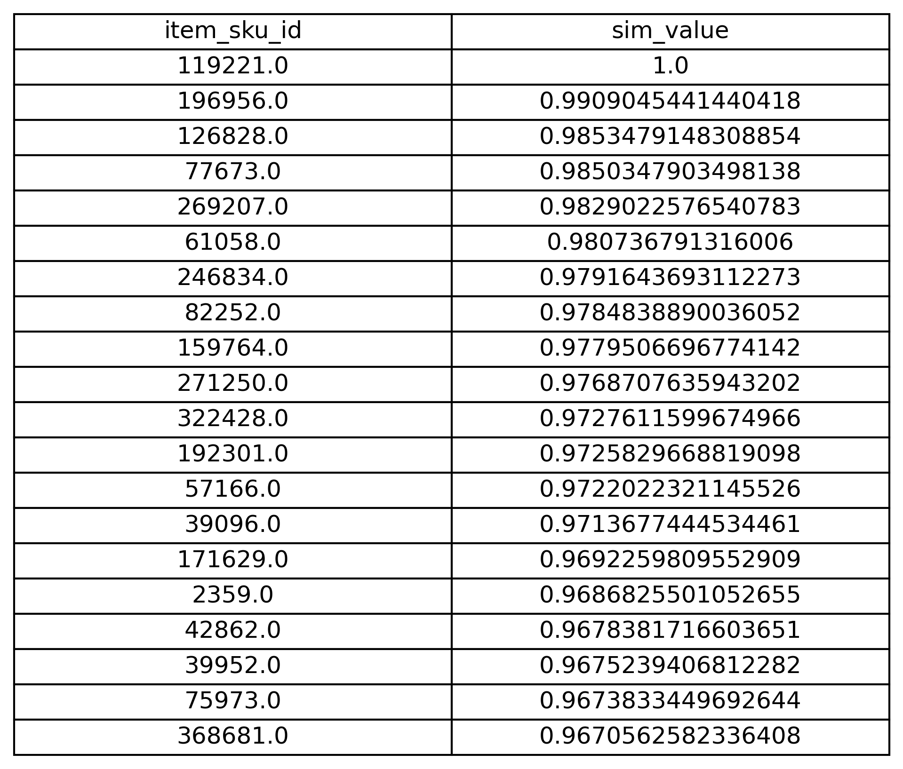
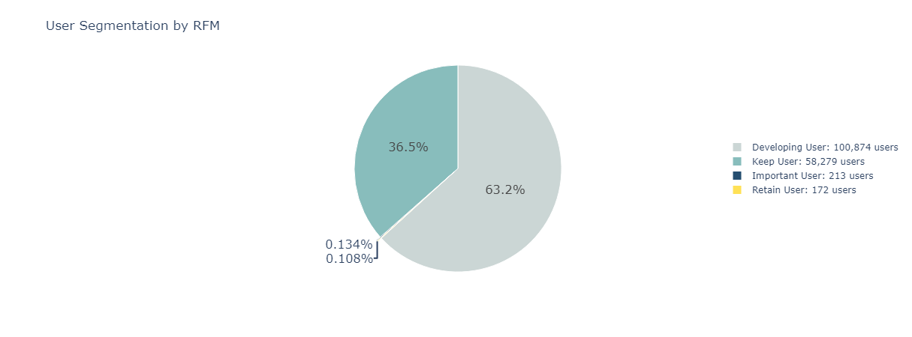

# 🛍️ E-commerce User Segmentation & Product Embedding (RFM + Item2Vec)

This project analyzes user clickstream data from an e-commerce platform to segment users based on behavior (using RFM modeling) and discover product similarities (via Word2Vec embeddings). The outcome supports precision marketing and personalized recommendations.

---

## 📌 Project Overview

- **Objective:** Segment users into behavioral groups and identify product relationships based on user interactions.
- **Dataset:** ~37 million user behavior logs (click, cart, order, etc.)
- **Methods:**
  - RFM modeling (Recency, Frequency)
  - Word2Vec (Gensim) to create item embeddings
  - t-SNE for dimensionality reduction and visualization
  - Cosine similarity to generate item-to-item recommendations

---

## 🔧 Tech Stack

| Tool         | Purpose                        |
|--------------|---------------------------------|
| Python (Pandas, NumPy) | Data processing and feature engineering |
| Gensim       | Word2Vec model for item embeddings |
| Scikit-learn | t-SNE dimensionality reduction |
| Matplotlib / Seaborn / Plotly | Visualization |
| Jupyter Notebook | Analysis and presentation environment |

---

## 🔍 Key Features

### 1. 🧠 RFM User Segmentation
- **Recency**: Days since last purchase
- **Frequency**: Number of orders per user
- Users scored (1–5 scale) on R and F, then classified into:
  - **Important Users**
  - **Keep Users**
  - **Retain Users**
  - **Developing Users**

> ✅ Custom scoring logic applied: F weighted 2.65x more than R to reflect behavioral importance.

### 2. 🧊 Item2Vec Embeddings
- User click sequences are treated as "sentences"
- Word2Vec trains vector representations of products
- Similar items identified via cosine similarity
- Visualized using **t-SNE** embedding map

### 3. 📈 Business Insights
- Most users are in the "Developing" category → activation opportunity
- VIP users are few but high-value → reward programs applicable
- Item similarity enables personalized recommendations (e.g., "You may also like...")

---

## 📊 Visual Examples

| User Behavior by Hour | Category Purchase Distribution | Item Similarity | RFM Segmentation |
|------------------------|-------------------------------|------------------|------------------|
|  |  |  |  |


---

## 🗂️ Files in This Repo

| File                        | Description                          |
|-----------------------------|--------------------------------------|
| `rfm_segmentation.ipynb`    | RFM scoring and user classification  |
| `item2vec_model.ipynb`      | Word2Vec training and similarity     |
| `visualizations/`           | Key visual outputs (charts, tsne)    |
| `data/`                     | Sample data (if permitted)           |

---

## 🚀 Getting Started

1. Clone this repo  
2. Install requirements:  
   ```bash
   pip install -r requirements.txt
